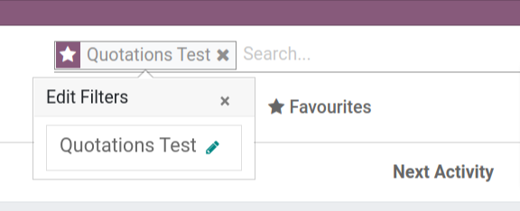
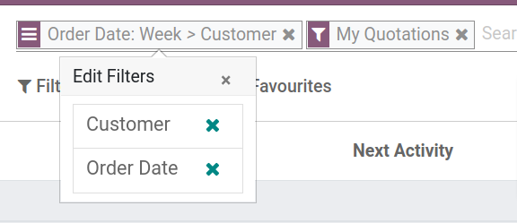

Edit a favourite filter:

1.  Go to a list or kanban view;
2.  open the advanced search options;
3.  open the 'Favorites' menu;
4.  Select a filter and click on the star icon of the filter name
5.  click on the pencil icon to start editing the filter.

Edit a facet:

1.  Click on the facet;
2.  a menu is now shown which allows you to remove values from the
    facet;
3.  to cancel removal you can click outside the popover.

